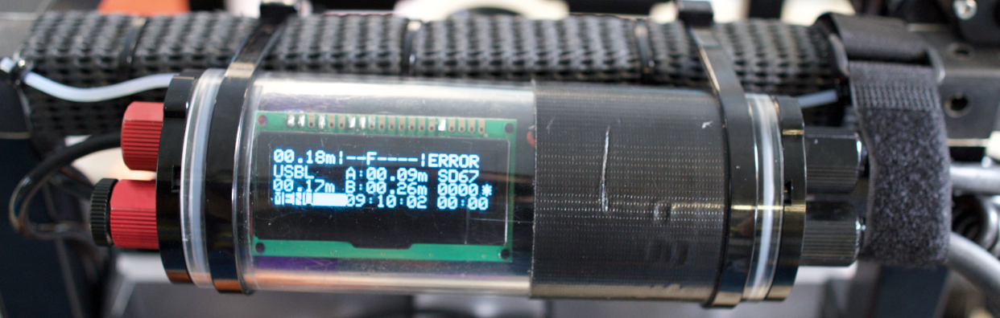

## Extract bottom depths for photos from altimeter data

Create a timesync folder within the plots/timepoint folder:

```bash
$ cd /mnt/coral3d/focal_plots/cur_kal/cur_kal_60m/cur_kal_60m_20200214
$ mkdir cur_kal_60m_20200214.alt
```

Find the timesync photograph ("screenshot") for the altimeter of that day, and copy it to that folder as a permanent record:

```shell
$ cp ~/mounts/curacao_raw/[folder]/0X7A9986.CR2 cur_kal_60m_20200214.alt/
```

Then determine the offset through the exiftool:

```shell
# Standardize timezone
$ TZ='UTC0'; export TZ
# Determine offset by extracing DateTimeOriginal from exit
$ exiftool -time:DateTimeOriginal cur_kal_40m_20200214.alt/0X7A9986.CR2
Date/Time Original              : 2020:02:14 09:11:37
# offset = 09:10:02 - 09:11:37 -  =  -95 secs
# negative value here as altimeter is 95 secs behind the camera
```



Match altimeter data with images and output to csv file with the [timesync_files.py](scripts/timesync_files.py) script:

```shell
# Extract DateTimeOriginal from exif of cameras/photos
$ cd cur_kal_60m_20200214.photos 					# or cur_kal_60m_20200214.raw prior to processing
$ for i in *.jpg; do camtime=$(exiftool -time:DateTimeOriginal $i | tail -c 20); echo $i "," $camtime; done > ../temp_camera_times.csv # or *.CR2 for raw folder
# Match images with altimeter metadata (-95 seconds offset and
# maximum allowed deviation of 2 seconds)
# aratui_filtered2.csv is the file with all the altimeter data
$ TZ='UTC0'; export TZ
$ timesync_files.py temp_camera_times.csv aratui_filtered2.csv -95 2 > cur_kal_60m_20200214.alt.csv
$ rm temp_camera_times.csv
```

