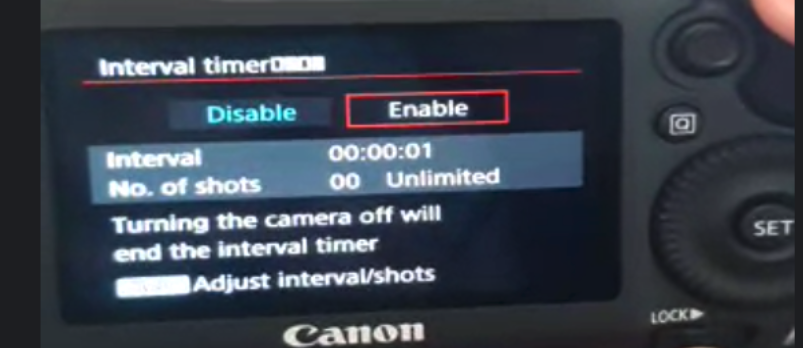
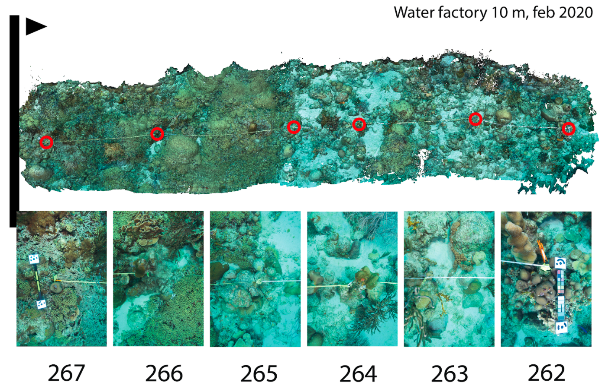

# Photogrammetry field protocol

## Camera checklist (without altimeter)

| Date: |      | Location: |      | Divers: |      |
| ----- | ---- | --------- | ---- | ------- | ---- |

|      | Task                                                         | Description                                                  |
| ---- | ------------------------------------------------------------ | ------------------------------------------------------------ |
|      | *Frame*: install camera housing & strobes                    | If not already done, install camera housing and strobes onto frame. Check ballmounts are tightened and do not turn |
|      | *Canon 5D:* install battery & cards, and check time          | Install battery (and cards if necessary)- Check whether battery is full- Format CF and SD cards- Check time and update if necessary (https://time.is/Curacao) |
|      | *Canon 5D:* check settings                                   | Mode: M, Shutter: 1/160, Aperture: F8, ISO: 320, Picture: RAW (only), Storage: to CF card (only), Intervalometer: 1s. Turn off.  |
|      | *Canon 5D:* set intervalometer and turn off                  | Intervalometer: 1s. Turn off.      |
|      | *Aquatica:* check domeport                                   | - Ensure it is properly sealed (does not pull off) - Shake housing gently to ensure no loose items - Check there is no dust, hairs or loose items when looking through dome (when facing down) |
|      | *Aquatica*: check housing                                    | Visually inspect O-ring while installed, remove minor dust. If dirty, remove o-ring clean out groove, and lube/reseat o-ring |
|      | *Aquatica:* install 5DsR in housing                          | \- Move cables to the side - Slide the camera in until an obvious click - Connect the strobe hotshoe - Move other cables to the side so they do not interfere with any of the buttons and will not move around - Check both camera and back of housing are in OFF mode and Camera mode (not movie) - Install back of housing operating both latches at same time |
|      | *Canon 5D:* check housing seal when closed                   | Assess proper seal (same distance everywhere)                |
|      | *Canon 5D:* check domeport again                             | Repeat domeport checks now camera is installed               |
|      | *Strobes:* check o-rings & install batteries                 |                                                              |
|      | *Strobes:* check settings                                    | M, -4, Pilot up, Pre down                                    |
|      | *Strobes:* tighten ballmounts & ensure all 4 cables are connected |                                                              |
|      | *System check*                                               | \- Turn on camera and all 4 strobes - Check settings are correct - Point camera at something and take test shot - Ensure that all 4 strobes fire- Ensure that picture is taken and stored to SD card - Repeat for intervalometer (1s) - Turn everything off |

## Field protocol

### Required items:

* Camera frame with camera and strobes
* 2 x Scaling targets (one with scale and other with color reference card)
* 4 x Depth targets (weighted)
* Depth gauge & compass
* Wetnotes / slate for noting down depth range 
* Altimeter or large ruler/stick (to gauge 1-1.3m distance)
* Laminated print-out of plots (with cattle tag marker numbers)
* Spare cattle tags to replace missing markers

### In-water sequence for shallow plots:

|      | Camera diver                                                 | Secondary diver                                              |
| ---- | ------------------------------------------------------------ | ------------------------------------------------------------ |
|      | **Establish transect**                                       |                                                              |
|      | Find starting cattle tag at target depth                     | Attach transect tape to first tag                            |
|      | Find next cattle tags (5, 10, 15, 20 and 25 m distance)      | Roll out transect tape 5m each time and find/attach to next cattle tag |
|      |                                                              | Ensure transect tape is securely positioned at end of transect (does not move) |
|      | Take several test photos at ISO 320 (default). If overexposed - change to ISO 160 or if underexposed move a bit closer to substrate (if that does not help use ISO 640) | Position a "scaling target" (with color reference) at the end of transect, ideally outside of transect and in perpendicular position (relative to transect line). Ensure it is secure & will not be able to move. |
|      |                                                              | Place a "depth target" in top right and bottom right of plot (~2m distance above final cattletag - measure roughly with reference stick) |
|      |                                                              | Swim to the beginning of transect and position a "scaling target" (with ruler; just outside transect ideally) |
|      | When ready, start intervalometer mode (1sec), press shutter, and let it take several photos at target (1-1.3m distance) | If not using altimeter: hold large ruler perpendicular to substrate for camera diver to help gauge imaging altitude (1-1.3m) |
|      | Swath 1: swimming out right over transect line               | Place a "depth target" in top left and bottom left of plot (~2m distance above final cattletag - measure roughly with reference stick) |
|      | Swath 2: returning below transect line (0-1.5m)              | Measure depth and heading in the middle of the scaling bar (in between the agisoft targets) and write down |
|      | Swath 3: swimming out further below transect line (1.5-3m)   | Measure depth and heading in the middle of the other scaling bar (in between the agisoft targets) and write down |
|      | Swath 4: returning above transect line (-0--1.5m)            | Measure depth and heading for each of the four depth targets and write down. |
|      | Swath 5: further above transect line (-1.5--3m)              | (If time permits - record depth for each cattle-tag, at the hole where the cable tie goes through) |
|      | Swath 6: right over transect line (=repeat) (focus a bit more on 3D structure) & hold stationary for a bit at the starting scaling target |                                                              |
|      | [Time allowing: Swath 7: way below transect line (3-4.5m)]   |                                                              |
|      | [Time allowing: Swath 8: way above transect line (3-4.5m)]   | Remove scaling bars & depth targets                          |
|      | Swim back while other diver rolls up transect line           | Roll up transect line                                        |

#### Notes:

* Always keep camera perpendicular to the substrate (particularly when using strobes)

* At the end of each swath, slowly turn the camera 90 degrees (usually ~1 m horizontally beyond the actual transect)  while keeping it pointed at the same exact spot on the substrate, then moving to the right vertical position for the next swath, and again turn the remaining 90 degrees while pointing at a spot on the substrate, and then start the next swath. This ensures that there is sufficient overlap between photos when turning the cameraa, as this can often be an issue.=

## Plot description 

Each shallow plot (5, 10 and 20 m depth) is 25m long and at least 4m wide. The plot is determined by a transect line in the middle, which can be reconstructed by finding the 6 cattletags that are spaced every 5  meters (so at a distance of 0, 5, 10, 15, 20 and 25 m). Take a laminated print-out of the plot (as above) to determine the position of missing cattle tags. In the case of missing ones, replace with a spare cattle-tag and make a note in wetnotes to update plot information.

